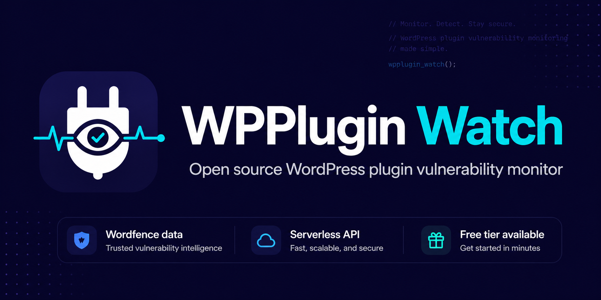
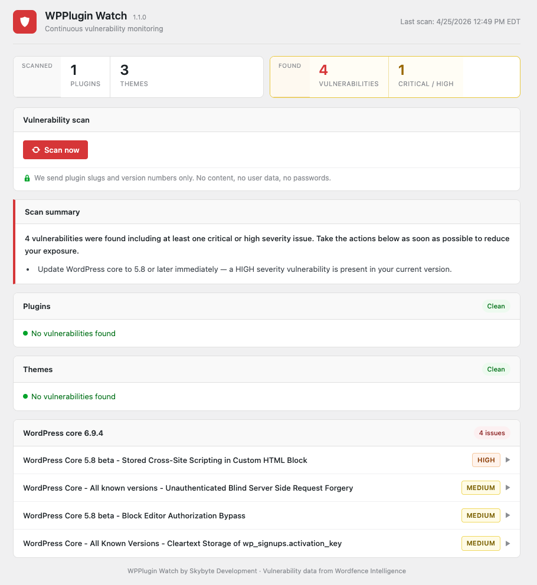

# WPPlugin Watch




Continuous vulnerability monitoring for WordPress plugins, themes, and core. Clear results, direct risk signals, and actionable updates.

## Overview

WPPlugin Watch scans your WordPress installation against the Wordfence Intelligence vulnerability feed and highlights known vulnerabilities with clear severity ratings and actionable guidance.

Designed for real-world site owners who need clarity, not security jargon.

## What You’ll See

- Real-time vulnerability counts  
- Clear severity signals (Critical / High / Medium / Low)  
- Direct identification of affected plugins, themes, or core  
- Immediate guidance on what to update and why  

## Features

- Detects known vulnerabilities (CVEs) in plugins, themes, and WordPress core  
- Clear severity classification: Critical, High, Medium, Low  
- Plain-language explanations for each finding  
- Identifies exactly what needs to be updated  
- Daily background checks for newly disclosed vulnerabilities  
- Privacy-first design — no personally identifiable information collected  

## Interface



## Architecture

- WordPress plugin collects local inventory (plugins, themes, core version)  
- A one-way SHA-256 fingerprint identifies the site  
- Inventory is sent to the backend (`api.wpplugin.watch`)  
- Backend matches against the Wordfence Intelligence vulnerability database  
- Results returned with severity and explanations  

## Privacy

- No usernames, emails, or content are transmitted  
- Site identity is represented only as a non-reversible SHA-256 fingerprint  
- Data sent is limited strictly to software inventory required for vulnerability matching  

## Requirements

- WordPress 6.0 or higher  
- PHP 8.0 or higher  

## Installation

### Build and install locally

1. Clone the repository:
   ```bash
   git clone https://github.com/skybytedevelopment/wpplugin-watch-client.git
   cd wpplugin-watch-client
   ```

2. Build the plugin zip:
   ```bash
   ./build.sh
   ```
   The script outputs a versioned zip to the `dist/` directory.

3. In WordPress admin, go to **Plugins → Add New → Upload Plugin**
4. Upload the zip from `dist/` and activate
5. Navigate to **WPPlugin Watch** and run your first scan

> Note: A prebuilt release zip is not yet published. Installation currently requires building from source. This will be updated once the plugin is available in the WordPress Plugin Directory.

## How It Works

1. The plugin gathers installed plugin slugs, theme slugs, and WordPress core version  
2. This inventory is securely transmitted to the backend with a site fingerprint  
3. The backend checks for known vulnerabilities using the Wordfence Intelligence database  
4. Results are returned with severity ratings and plain-language explanations  
5. A daily check identifies new vulnerabilities and available updates

## Building from Source

```bash
git clone https://github.com/skybytedevelopment/wpplugin-watch-client.git
cd wpplugin-watch-client
./build.sh
```

`build.sh` prompts for an optional dev API endpoint override and outputs a versioned zip to `dist/`. See [CONTRIBUTING.md](CONTRIBUTING.md) for details.

## License

GPL-2.0-or-later. See [LICENSE](LICENSE).
